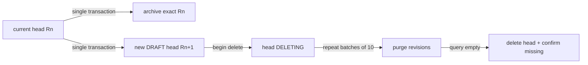

# ADR-012｜案件 head 與不可變版本快照分離保存

狀態：`Accepted / 架構已定案 / 已實作`

日期：`2026-09-21`

關聯任務：`DEV-029`

決策來源：使用者要求保留及查看歷史版本，並以引導決策 `1A 2B` 確認永久刪除全部版本及可用目前版型重新產生歷史 PDF。

## Context

現行 `cases/{caseGroupId}` 同時是案件識別與目前內容；建立新版會直接覆寫該 document，因此舊輸入、計算與報告 snapshot 無法返回查看。架構必須在 ADR-009 的 Firebase Spark、Anonymous Auth、純靜態 SPA 與 client-only transaction 邊界內，同時滿足：

- 建版時舊版快照與新 head 必須原子成功或原子失敗。
- 歷史版建立後不可更新，且不得從目前版補值或重新計算。
- 案件清單仍只維持一案一列，不因版本數增加而膨脹。
- 刪除案件必須涵蓋目前版與所有歷史版，失敗可重試且不得提前宣稱成功。
- 歷史 PDF 只用歷史 report snapshot 與目前 renderer，並揭露為重新產生。

Cloud Firestore 的 document 上限為 1 MiB；把成長中的歷史陣列嵌入 head 會讓單一 document 持續膨脹。官方也明確說明刪除 parent document 不會刪除 subcollection，因此刪除協定不能假設 cascade。

## Considered Options

### A. 繼續只保存目前案件

不採用。無法滿足歷史查看，且每次建版永久覆寫前一版。

### B. 把全部歷史嵌入 `cases/{caseGroupId}`

不採用。版本數增加會持續放大 head，增加讀取成本並最終接近 Firestore document size 限制；也無法對單一版本套用不可變規則。

### C. 目前 head + immutable revision subcollection

採用。head 保持現有查詢與編號契約；每個歷史版是獨立 document，可原子封存、單獨讀取並拒絕 update。

### D. Cloud Functions／Admin SDK 遞迴刪除

本階段不採用。可信任 backend 最適合做無界集合遞迴刪除，但會改變 ADR-009 的 Spark/client-only 邊界及計費、部署與身分責任。若未來加入角色、敏感資料或大量版本，再另立 ADR。

## Decision

### 1. Canonical storage model

```text
cases/{caseGroupId}                         mutable current head
cases/{caseGroupId}/revisions/{recordId}    immutable archived CaseDocument
```



- `cases/{caseGroupId}` 繼續使用既有 `CaseDocument schemaVersion = "3.0"`，代表唯一可編輯的目前版本。
- archive document 是封存前 head 的完整、逐欄相同 `CaseDocument`；不另包 `snapshot` map、不加入可變 metadata，也不截斷任何 JSON payload。
- `{recordId}` 必須等於封存前 `resource.data.id`。每次新版本都產生新的 UUID，因此同一版有唯一、可由 Rules 驗證的 archive path。
- archive 自身已有 `caseGroupId`、`revisionNo`、`version`、`updatedAt`、輸入、計算、assessment、override 與 report draft。版本清單顯示「該版最後更新時間」，不捏造額外封存時間。
- 完整性由「transaction 內 archive 必須等於更新前 head」與 archive 永久拒絕 update 保證；不建立第二套 snapshot hash。既有 report draft 的 `snapshotHash` 維持原契約。
- 歷史查詢使用該案件的 `revisions` subcollection，依 `revisionNo desc` 排序；不需要 composite index，`firestore.indexes.json` 維持空清單。

### 2. Atomic create-version protocol

`CaseStore` 新增專用 `archiveCurrentAndMutate()`，不得以一般 `mutate()` 模擬建版：

1. transaction 先讀取 `cases/{caseGroupId}` 與目標 `revisions/{oldRecordId}`，驗證 `expectedVersion`、`REPORT_DRAFT`、report draft 存在且 archive path 尚不存在；所有 reads 必須在 writes 前完成。
2. 以舊 head 的 `id` 寫入 `revisions/{oldRecordId}`，內容為舊 head 的 exact `CaseDocument`。
3. transaction 更新 head：新 UUID、`revisionNo + 1`、`version + 1`、`DRAFT`，並依既有契約清空輸入、計算、assessment、override 與 report draft。
4. 任一步驟失敗，兩個 writes 全部不生效；Firestore transaction 的 retry 不得直接修改 React state。

Rules 必須雙向綁定這兩個 writes：

- head 的 revision increment 只有在 `getAfter(revisions/{oldHead.id}).data == resource.data` 時允許。
- archive create 只有在 path `{recordId} == get(parent).data.id`、`request.resource.data == get(parent).data`，且 `getAfter(parent)` 是合法下一版 head 時允許。
- 一般 head update 必須保持 `revisionNo` 與 `id` 不變；archive `update` 永遠拒絕。
- 合法下一版 head 必須保留 `caseGroupId`、`caseNo`、案件基本資料、task／mode、建立者與 `createdAt`；只變更新 `id`、連續 revision／version、`updatedAt`、`DRAFT`／null 狀態及被清空的工作資料。新 `id` 不得已存在於 revisions。

這個設計使用 `get()`／`getAfter()` 驗證同一 atomic operation，符合 Firestore mobile/web transaction 的 Rules 模型。

### 3. History read model and routes

- `GET` 語意由 client repository 提供：`listHistory(caseGroupId)` 與 `getHistory(caseGroupId, revisionNo)`。
- SPA routes 固定為：
  - `/cases/:id/history`
  - `/cases/:id/history/:revisionNo`
  - `/cases/:id/history/:revisionNo/report`
- `/cases` 仍只查 `cases` collection。版本文字是歷史入口，不新增另一個主要 action column。
- history list 合併 current head 與 archives；current row 導回 `/cases/:id`，只有 archive row 進入唯讀 detail。
- `getHistory(caseGroupId, revisionNo)` 以 revision 等值 query 並限制最多 2 筆；0 筆回 Not Found，超過 1 筆視為資料完整性錯誤，禁止任選一筆掩蓋衝突。
- 歷史 detail 使用獨立唯讀 view；只共用純呈現元件，不 mount 可寫的 workbench mutation actions。
- 功能啟用前已遺失的版本不 migration。若 `revisionNo > 1` 且實際 archive 不連續，顯示「早期版本未保留」。

### 4. Historical report regeneration

- 只有 archive 的 `reportDraftJson` 可 decode 出既有 snapshot 時才提供報告入口。
- `historical-report-service` 只讀 archive，禁止呼叫 `mutateCase`、`exportReportDraft` 或重新計算。
- 使用目前 `renderReportHtml`，透過 ephemeral provenance option 加入 `REGENERATED_HISTORY`；不修改被保存的 snapshot。
- 預覽標題、PDF 本文固定警語及檔名三處都顯示「重新產生」。檔名固定：`{caseNo}-R{revisionNo兩位數}-REGENERATED.pdf`。
- 歷史報告頁可以依現行功能重新產生草稿／正式版面，但兩種輸出都不得宣稱是當時原始 PDF，也不得保存回 Firestore。

### 5. Idempotent permanent deletion

新增 head lifecycle `DELETING`，採三階段可重試協定：

1. `beginDelete(caseGroupId, expectedVersion)`：transaction 僅把 active head 改為 `DELETING`，同步 `version + 1` 與 `updatedAt`。若已是 `DELETING`，視為可續跑；其他 mutation、建版與報告寫入一律拒絕。
2. `purgeHistory(caseGroupId)`：每次查詢最多 10 個 revision documents，以 write batch 刪除，重複到查詢為空。小批次避免依賴 Rules access-call cache；中斷後可從剩餘文件續跑。
3. `finishDelete(caseGroupId)`：再次確認 revisions query 為空後刪除 head，並重新讀取確認 head 不存在；只有這時 UI 顯示成功。

Rules 約束：archive delete 只在 parent head 為 `DELETING` 時允許；head delete 只在自身為 `DELETING` 時允許。刪除中的案件仍留在 `/cases`，顯示「刪除未完成／繼續刪除」，不得當作完成或一般 editable case。

為了讓 client 在中斷後重新查詢剩餘 archives 並續刪，已登入使用者在 parent 存在時仍可讀取 revision documents，包括 parent 為 `DELETING` 的短暫期間。這是刪除協定的必要能力，不代表 UI 可以顯示歷史內容：application 必須先讀 parent；一旦看見 `DELETING`，history routes 只呈現刪除恢復狀態，只有 deletion repository 可列舉待清理 archives。parent 刪除後，revision read 因 parent 不存在而由 Rules 拒絕。

Firestore Rules 無法證明某 subcollection 已為空，也無法讓 parent delete 自動 cascade。此架構以 `DELETING` 阻止新增 archive、client 查空後才刪 head，確保正常應用流程可完成且可重試。已接受的殘餘風險是：在 ADR-009 的共享匿名威脅模型下，惡意 client 可繞過 UI 提前刪除已標記 `DELETING` 的 head，留下不可由一般 UI 讀取的 orphan archive。若要消除此風險，必須移至可信任 backend；不以放寬 Rules 或宣稱原子遞迴刪除掩蓋限制。

### 6. Rules and compatibility

- 未登入一律拒絕 current head 與 revisions。
- revision read 需 parent 存在；`DELETING` 期間仍允許已登入 client 列舉待清理 archives，history UI 則必須拒絕呈現內容並只提供續刪。parent 不存在時 orphan 不可由一般 client 讀取。
- 新 archive 不新增寬鬆 catch-all；未宣告 collection 繼續 deny。
- `DELETING` 只允許由 active lifecycle 進入，且該 transition 除 `lifecycleStatus`、`version`、`updatedAt` 外不得改其他欄位。
- 現有 document 直接視為 current head；不批次 migration、不建立 placeholder archive。
- `ISSUED`／`SUPERSEDED` 相容資料維持唯讀，不能進入建版或 client 刪除流程。

## Consequences

### Positive

- 建版保留與 head 切換位於同一 transaction，不會出現有新版本卻沒有舊快照的半套狀態。
- archive 與現行 CaseDocument 完全同型，可重用 strict decode，且不因 wrapper 增加 document size。
- 案件清單與搜尋維持現有成本；只有進入歷史頁才讀 subcollection。
- 刪除流程可在 browser 中斷後重試，並明確揭露未完成狀態。

### Trade-offs

- 一個版本等於多保存一份完整 CaseDocument，會增加 Firestore 儲存與讀取量。
- client-only 架構無法以 Rules 證明 subcollection 已清空；完全防惡意遞迴刪除需要可信任 backend。
- `DELETING` 期間 Rules 仍須允許 authenticated revision read 才能續刪；因此只能由 application flow 隱藏歷史內容，無法阻止惡意已登入 client 在刪除窗口直接讀取尚未清掉的 archives。
- 歷史 PDF 是目前 renderer 的重新產物，不是當時原始檔或不可變證據。
- 啟用前已覆寫的歷史無法恢復。

## Implementation Boundary

本 ADR 本身只負責架構定案，不提供操作授權；產品實作與 release 必須依 SPEC-003、QA-002 及正式 release gate 執行，且不可把 `DELETING` 或 revision subcollection 部分發布到 production。本次 `2e1d261` 已完整發布 Rules／Hosting；未執行 production migration 或正式案件資料寫入／刪除。

## Official References

- [Firestore transactions and batched writes](https://firebase.google.com/docs/firestore/manage-data/transactions)
- [Firestore Security Rules `getAfter()` conditions](https://firebase.google.com/docs/firestore/security/rules-conditions)
- [Firestore Rules field validation and map comparison](https://firebase.google.com/docs/firestore/security/rules-fields)
- [Firestore data model：刪除 parent 不會刪除 subcollections](https://firebase.google.com/docs/firestore/data-model)
- [Delete data：web/mobile client 刪除 collection 的限制](https://firebase.google.com/docs/firestore/manage-data/delete-data)
- [Firestore usage and limits：document 上限 1 MiB](https://firebase.google.com/docs/firestore/quotas)

## Relationship

- 延續 ADR-009 的 Spark、Anonymous Auth、client-only 與 shared cases 邊界。
- 延續 ADR-010 的瀏覽器報告 renderer，但新增「歷史資料套用目前版型重新產生」的 provenance；不建立核發或原始 PDF 留存。
- SPEC-003 是本 ADR 的 feature contract；QA-002 是 implementation verification contract。
