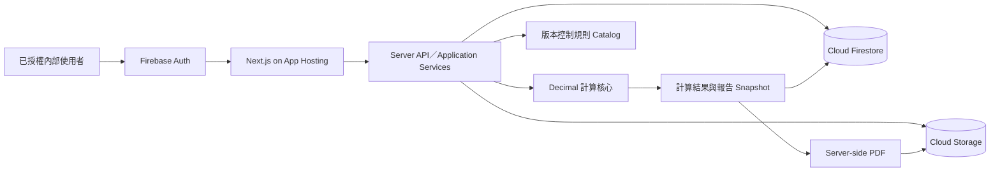

# 專案總覽｜油脂截留器雙軌計算與設計報告系統

文件狀態：`Firebase Local Engineering Complete - Human Pilot Pending`
版本：`3.0`
日期：`2026-07-17`

## 1. 產品目的

核心目標是讓每次設計需求計算可重算、可解釋且結果正確。案件與報告是多人作業的便利資料，不承擔法規稽核或長期資產保存要求。

```text
選擇客戶任務 → 選擇計算模式 → 補必要資料 → server-side 計算
→ 完成報告草稿 → 工程覆核 → 產生 snapshot 與 PDF
```

第一階段由鉦富已授權的內部使用者操作；客戶不直接登入。

## 2. End-State Architecture



信任邊界：

- 公式只存在於純 TypeScript／Decimal domain calculator。
- UI、API controller 與 PDF template 不複製公式。
- 所有正式寫入由 Next.js server 驗證 Firebase session 與角色後執行。
- Firestore transaction 保護案件 aggregate 的 optimistic version 與狀態轉換。
- 本機 memory adapter 與 Firestore adapter 共用同一 `CaseStore` 契約。

## 3. 不可妥協規則

1. 新舊兩軌使用不同 calculator、參數命名空間、單位與結論語意。
2. 任一有效軌可讓雙軌案件進入覆核；不足軌只能提醒。
3. 資料不足軌不建立假 `CalculationRun`，只保存 `TrackAssessment`。
4. 正式比較與反推限制使用高精度 raw 值；來源顯示值只作回歸證據。
5. 核發 PDF 只從當下 snapshot 產生，不在輸出階段重算。
6. 系統不執行產品型號、能力真偽或證書符合性判定。
7. 同一位使用者可依序完成編製、覆核與核發；責任欄位與時間仍分開保存。
8. production 不得使用 memory adapter，也不得接受匿名或未授權 API 存取。

## 4. 參考技術架構

- 語言：TypeScript；套件版本由 lockfile 固定。
- Web：Next.js 模組化單體，UI 與 application 共用型別，不共用 side effect。
- 計算：Decimal.js；禁止 JavaScript `number` 作正式精度判定。
- 規則：版本控制內的唯讀 TypeScript catalog 與 checksum。
- 資料：本機 memory；正式 Cloud Firestore aggregate documents。
- 身分：本機開發 identity；正式 Firebase Auth session cookie 與 role custom claims。
- 報告：snapshot → deterministic HTML → server-side Chromium → PDF。
- 檔案：本機 `output/pdf`；正式 Cloud Storage。
- 託管：Firebase App Hosting；正式設定與部署進入 DEV-012 release gate。

架構決策以 [ADR-007](decisions/ADR-007-firebase-managed-architecture.md) 為準；ADR-003 的 PostgreSQL 與 provider-neutral persistence 已被取代。

## 5. 模組責任

| 模組 | 責任 | 禁止事項 |
| --- | --- | --- |
| Case | 內部團隊共享案件、revision、輸入、狀態與 optimistic version | 不做公式運算 |
| Rule | 來源 metadata、規則版本與 checksum | 不在 runtime 修改 ACTIVE 規則 |
| Calculators | 兩份依據的正向與反向計算 | 不讀 UI、Firestore 或 PDF |
| Orchestrator | 軌別完整性、隔離執行與案件級狀態 | 不建立第三套混合公式 |
| Review | 草稿、送審、退回、覆核與核發狀態 | 不允許唯讀狀態重新計算 |
| Report | snapshot、HTML、PDF、雜湊與儲存 | 不在輸出時重新計算 |
| Auth | local／Firebase 身分與角色驗證 | 不信任 client 傳入的角色 |
| Data | memory／Firestore `CaseStore` adapter | 不把儲存格式帶入 domain calculator |

## 6. 角色

| 角色 | 可執行 |
| --- | --- |
| `ENGINEER` | 建案、輸入、計算、覆核、核發與建立修訂版 |
| `RULE_ADMIN` | 檢視規則與來源；後續規則版本管理 |
| `SYSTEM_ADMIN` | 使用者與角色管理；不得改計算結果 |

## 7. Phase Coverage

| Phase | 狀態 | 證據／下一步 |
| --- | --- | --- |
| 計算與工作流 | Complete | unit、integration、E2E、PDF |
| Firebase 本地重構 DEV-018 | Complete | memory adapter、Firebase adapters、production build、三 viewport E2E |
| 真實案件平行試算 DEV-011 | Pending Human | 需 3～5 個去識別案件與人工預期值 |
| 正式部署 DEV-012 | Release Gate Required | 建立 Firebase project、帳號、claims、環境變數、部署與 smoke |

## 8. 主要風險與控制

- 計算回歸：公式、來源 checksum、邊界與 golden cases 由 unit tests 固定。
- 單位或捨入混用：raw、source display、adopted 分欄；正式判定只用 raw。
- Firestore 競爭寫入：transaction 加 optimistic version，衝突回傳 409。
- 團隊協作：所有具系統角色的同事共享案件；正式環境由 Firebase Auth 與 role claims 限制在內部人員。
- client 越權：Firestore／Storage rules deny all，client 只呼叫 server API。
- memory 誤用於 production：環境解析在 production 強制 Firebase backend。
- 雲端設定錯誤：DEV-012 執行 staging／production release gate 與 smoke test。
- 報告不屬重要資產：不重建 SQL audit event stream；需要正式保存政策時另立 ADR。

## 9. Re-entry Trigger

- 正式 Firebase project、Auth provider、角色 claim、成本與備份：使用者提出部署時進入 DEV-012。
- 真實案件計算差異：收到去識別資料後進入 DEV-011。
- 報告保存或稽核要求改變：重新評估資料模型、留存、備份與不可變性。
- 法規來源更新：建立新規則版本與 regression evidence，不覆寫既有 catalog。
