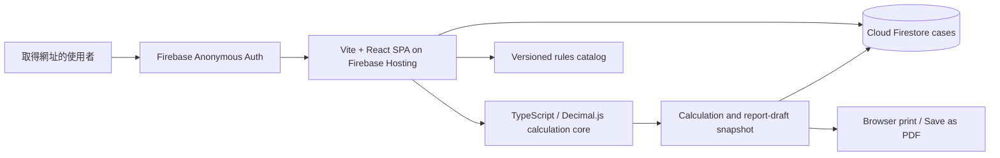

# 專案總覽｜油脂截留器雙軌計算與報告草稿系統

文件狀態：`Static Spark Local Acceptance Passed`

版本：`4.1`

日期：`2026-07-17`

## 1. 產品目的

讓同事以公開網址建立共享案件，依兩份計算依據完成正向／反向計算、比較結果、預覽與匯出報告草稿。

```text
匿名登入 → 建案 → 選模式與任務 → 填資料 → 瀏覽器計算
→ Firestore transaction 保存 → 預覽報告草稿 → 瀏覽器列印／另存 PDF
```

本產品不提供公司身分驗證、角色、正式簽核、正式核發、不可變報告保存或 PDF 雲端留存。

## 2. End-State Architecture



production artifact 是 `dist/` 靜態檔。Hosting 對 `**` rewrite `/index.html`，因此任意 case ID 路由可直接開啟與重新整理。

## 3. 信任與資料邊界

- 計算公式只在 domain calculator；UI 與 report template 不另抄公式。
- 計算、報告 HTML 與規則會下載到瀏覽器，不能視為可信任後端執行。
- Firestore 只有 `cases` collection。Rules 驗證登入、欄位白名單、型別、長度、狀態列舉與 version 遞增。
- 複雜 case payload 以有大小上限的 JSON string 保存；client Zod schema 驗證內容，Rules 不保證 JSON 內的工程語意。
- create、calculate、revision、report draft 以 Firestore transaction 保護 optimistic version。
- 匿名使用者共用資料；沒有 per-user isolation。

## 4. 模組責任

| 模組                 | 責任                                        | 禁止事項                      |
| -------------------- | ------------------------------------------- | ----------------------------- |
| Domain calculators   | 雙軌公式、單位、raw/adopted 結果            | 不讀 React 或 Firebase        |
| Rules catalog        | 來源、參數、版本與 checksum                 | 不在 runtime 修改 active 規則 |
| Application services | 完整性、version、revision、report snapshot  | 不依賴 server runtime         |
| Firestore repository | client transaction、encode/decode、共享案件 | 不繞過 Rules                  |
| React UI             | 建案、工作台、錯誤恢復、報告與列印入口      | 不宣稱正式核發                |
| Firebase Auth        | 自動匿名登入                                | 不代表公司人員身分            |

## 5. 產品規則

1. `CURRENT_QG` 與 `LEGACY_QV` 隔離計算；`DUAL_COMPARISON` 不建立第三套混合公式。
2. 雙軌任一軌有效即可產生報告草稿；不足軌必須揭露。
3. 資料不足軌只保存 assessment，不建立假 calculation run。
4. 精度判定使用 Decimal raw 值；顯示捨入不得回流計算。
5. 系統不判定產品、證書、現場施工或法規核准。
6. 舊 `ISSUED`／`SUPERSEDED` 只作唯讀歷史相容。

## 6. 技術基線

- TypeScript 6、React 19、Vite 8、React Router 7。
- Decimal.js 計算、Zod client schema。
- Firebase Web SDK Authentication + Firestore。
- Firebase Hosting Spark target，`dist/` static output。
- Vitest、Firebase Rules Unit Testing、Playwright。

不使用 server bundle、API Routes、Firebase Admin SDK、Cloud Storage、Cloud Functions、Cloud Run、App Hosting 或 server-side PDF renderer。

## 7. Phase 狀態

| Phase                      | 狀態             | 說明                                                          |
| -------------------------- | ---------------- | ------------------------------------------------------------- |
| 雙軌計算與 UI              | Complete         | 既有核心與 responsive UI 保留                                 |
| DEV-021 Spark 靜態重構     | Complete locally | 程式、Rules、static build、integration 與三 viewport E2E 通過 |
| 真實案件平行試算           | Pending Human    | 需 3～5 個去識別案件及人工預期                                |
| Firebase production deploy | Not executed     | 需新 project、Anonymous Auth、Firestore 與人工 release gate   |

## 8. 主要風險

- 網址外流：第三方可操作共享案件；首版不放敏感資料。
- client 可修改：沒有可信任後端，無法提供正式核發或稽核保證。
- 配額：Spark 免費額度或 Firestore quota 到達時，UI 只能提示與重試。
- 同時編輯：version transaction 可避免靜默覆蓋，但使用者需重新載入後重做操作。
- PDF：報告使用隨站 Noto Sans TC，列印前等待字型與圖片完成載入，並固定 A4、表頭及斷頁規則；紙張、縮放與不同瀏覽器列印引擎仍可能造成細微差異，不承諾像素一致。

## 9. Re-entry Trigger

- 恢復正式核發、PDF 留存、公司帳號、角色或敏感資料時，重新引入可信任後端及新 ADR。
- 部署只能使用本系統專用 Firebase project，不得沿用 PDM／ProJED。
- 法規來源更新時建立新規則版本與 regression evidence，不覆寫現有 catalog。
