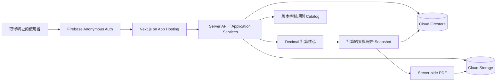

# 專案總覽｜油脂截留器雙軌計算與設計報告系統

文件狀態：`Public Firebase Pilot Release In Progress`
版本：`3.1`
日期：`2026-07-17`

## 1. 產品目的

核心目標是讓每次設計需求計算可重算、可解釋且結果正確。案件與報告是多人作業的便利資料，不承擔法規稽核或長期資產保存要求。

```text
選擇客戶任務 → 選擇計算模式 → 補必要資料 → server-side 計算
→ 預覽報告 → 核發並產生 snapshot 與 PDF
```

第一階段提供鉦富同事以公開連結試用；取得網址的人不需帳號即可操作，客戶不直接接收系統網址。

## 2. End-State Architecture



信任邊界：

- 公式只存在於純 TypeScript／Decimal domain calculator。
- UI、API controller 與 PDF template 不複製公式。
- 所有正式寫入由 Next.js server 驗證 Firebase session 後執行；第一版不要求角色 claim。
- Firestore transaction 保護案件 aggregate 的 optimistic version 與狀態轉換。
- 本機 local-file／memory adapter 與 Firestore adapter 共用同一 `CaseStore` 契約。

## 3. 不可妥協規則

1. 新舊兩軌使用不同 calculator、參數命名空間、單位與結論語意。
2. 任一有效軌可讓雙軌案件預覽並核發報告；不足軌只能提醒。
3. 資料不足軌不建立假 `CalculationRun`，只保存 `TrackAssessment`。
4. 正式比較與反推限制使用高精度 raw 值；來源顯示值只作回歸證據。
5. 核發 PDF 只從當下 snapshot 產生，不在輸出階段重算。
6. 系統不執行產品型號、能力真偽或證書符合性判定。
7. 系統採一人作業模式；同一位使用者可完成建案、計算、預覽、核發與修訂。
8. production 不得使用 local-file／memory adapter；瀏覽器以 Firebase Anonymous Auth 自動建立 session，未帶有效 token／session 的直接 API 請求仍拒絕。

## 4. 參考技術架構

- 語言：TypeScript；套件版本由 lockfile 固定。
- Web：Next.js 模組化單體，UI 與 application 共用型別，不共用 side effect。
- 計算：Decimal.js；禁止 JavaScript `number` 作正式精度判定。
- 規則：版本控制內的唯讀 TypeScript catalog 與 checksum。
- 資料：本機 local-file；測試 memory；正式 Cloud Firestore aggregate documents。
- 身分：本機開發 identity；正式 Firebase Anonymous Auth 與 session cookie，不設定 custom role claims。
- 報告：snapshot → deterministic HTML → server-side Chromium → PDF。
- 檔案：本機 `output/pdf`；正式 Cloud Storage。
- 託管：Firebase App Hosting；正式設定與部署進入 DEV-012 release gate。

架構決策以 [ADR-007](decisions/ADR-007-firebase-managed-architecture.md) 為準，公開存取政策以 [ADR-008](decisions/ADR-008-public-link-anonymous-access.md) 為準；ADR-003 的 PostgreSQL 與 provider-neutral persistence、ADR-006 的內部帳號限制已被取代。

## 5. 模組責任

| 模組 | 責任 | 禁止事項 |
| --- | --- | --- |
| Case | 內部團隊共享案件、revision、輸入、狀態與 optimistic version | 不做公式運算 |
| Rule | 來源 metadata、規則版本與 checksum | 不在 runtime 修改 ACTIVE 規則 |
| Calculators | 兩份依據的正向與反向計算 | 不讀 UI、Firestore 或 PDF |
| Orchestrator | 軌別完整性、隔離執行與案件級狀態 | 不建立第三套混合公式 |
| Report | 預覽、snapshot、HTML、PDF、雜湊、儲存與核發狀態 | 不在輸出時重新計算 |
| Auth | local／Firebase 身分與 session 驗證 | 不信任 client 自稱的身份或角色 |
| Data | local-file／memory／Firestore `CaseStore` adapter | 不把儲存格式帶入 domain calculator |

## 6. 第一版存取政策

- 開啟 App Hosting 網址後自動取得 Firebase anonymous identity 與 server session。
- 不顯示登入表單，不建立同事帳號，不設定 custom role claims。
- 有效 session 可使用目前全部產品功能；既有 role 型別只保留為程式相容層，不是首版管理介面。
- 所有案件為共享資料；網址外流即代表第三方也能讀寫、刪除與核發。

## 7. Phase Coverage

| Phase | 狀態 | 證據／下一步 |
| --- | --- | --- |
| 計算與工作流 | Complete | unit、integration、E2E、PDF |
| Firebase 本地重構 DEV-018 | Complete | local-file／memory adapters、Firebase adapters、production build、三 viewport E2E |
| 真實案件平行試算 DEV-011 | Pending Human | 需 3～5 個去識別案件與人工預期值 |
| 公開連結部署 DEV-012 | In Progress / Target Blocked | 建立獨立 Firebase project、啟用 Anonymous Auth、部署與 smoke |

## 8. 主要風險與控制

- 計算回歸：公式、來源 checksum、邊界與 golden cases 由 unit tests 固定。
- 單位或捨入混用：raw、source display、adopted 分欄；正式判定只用 raw。
- Firestore 競爭寫入：transaction 加 optimistic version，衝突回傳 409。
- 公開連結風險：知道網址的人共享全部案件；首版不放敏感資料，未來需要限制時另立 Auth／角色決策。
- client 越權：Firestore／Storage rules deny all，client 只呼叫 server API。
- local-file／memory 誤用於 production：環境解析在 production 強制 Firebase backend。
- 雲端設定錯誤：DEV-012 執行 staging／production release gate 與 smoke test。
- 報告不屬重要資產：不重建 SQL audit event stream；需要正式保存政策時另立 ADR。

## 9. Re-entry Trigger

- 獨立 Firebase project、Anonymous Auth、App Hosting 成本與 rollback：DEV-012 已進入 release gate；不得沿用既有 PDM／ProJED project。
- 真實案件計算差異：收到去識別資料後進入 DEV-011。
- 報告保存或稽核要求改變：重新評估資料模型、留存、備份與不可變性。
- 法規來源更新：建立新規則版本與 regression evidence，不覆寫既有 catalog。
