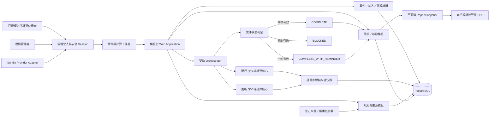

# 專案總覽｜油脂截留器雙軌計算與設計報告系統

文件狀態：`Local Engineering Complete — Human Pilot Pending`  
版本：`2.0`  
日期：`2026-07-13`

## 1. 產品目的

把每案重新找公式、挑參數、排版與說明的人工流程，轉成可版本化、可追溯、可覆核的工程規則系統：

```text
選擇客戶任務 → 選擇計算模式 → 補必要資料 → 系統計算
→ 工程覆核 → 建立不可變報告快照 → 核發設計計算書
```

主要使用者是鉦富已授權的內部計算使用者與規則管理者；同一位計算使用者可完成編製、覆核與核發。客戶不直接操作第一階段系統。

## 2. End-State Architecture



## 3. 不可妥協規則

1. 新舊兩軌使用不同的 calculator、參數命名空間、單位與結論語意。
2. 任一有效軌可讓雙軌案件進入覆核；不足軌只提醒，不能關閉主要 CTA。
3. 資料不足軌不建立假 `CalculationRun`，只保存 `TrackAssessment`。
4. 公式只存在於 domain calculator；UI、API controller 與 PDF 模板不得重算。
5. 所有正式比較與反推限制使用高精度 raw 值；來源顯示值只作回歸證據。
6. 已核發報告以完整快照封存；後續規則變更不能改變舊報告。
7. 現行 Q/G、舊版 Veff 與案件輸入的 Q/G 設計能力不得互相等同。
8. 系統不執行產品型號或證書匹配；反推能力值由使用者輸入並保存證據來源。
9. 同一位使用者可以依序編製、覆核與核發，但三個責任事件必須分開記錄。
10. 雲端 End-State 只允許已授權內部帳號；匿名與未授權 API access 必須拒絕。

## 4. 參考技術架構

第一階段採 provider-neutral 的模組化單體，避免在尚未確認託管平台時綁定雲端服務：

- 語言：TypeScript，所有套件版本於建立 lockfile 時固定。
- Web：React／Next.js 類型的 server-capable framework；UI 與 server application 共用型別，不共用 domain side effect。
- Database：PostgreSQL；透過 repository boundary 隔離 ORM。
- 數學：十進位高精度函式庫，不用 JavaScript `number` 作正式判定。
- Schema validation：runtime schema validator；API 與 domain input 分層驗證。
- 測試：unit／integration、瀏覽器 E2E 與 PDF snapshot 分層。
- PDF：由已封存 `ReportSnapshot` 產生 deterministic HTML，再由 server-side Chromium 或等價 adapter 轉 PDF。
- Auth：`AuthPort` adapter；本地使用 seed users，End-State 為雲端內部登入，正式 identity provider 延後到 release gate 確認。

詳細決策見 ADR-003。若 RD 選用等價框架，必須維持相同模組、交易、測試與 provider-neutral 邊界。

## 5. 模組責任

| 模組 | 責任 | 禁止事項 |
|---|---|---|
| Case | 案件、任務、模式、輸入、證據、假設 | 不做公式運算 |
| Rule | SourceDocument、RuleSet、FactorTable、版本與核准 | 不直接修改已啟用版本 |
| Current Calculator | 現行面積／人數／反推 Q/G | 不讀 UI、DB 或 PDF |
| Legacy Calculator | 舊版人數／面積／反推 Q/V | 不借用現行參數 |
| Orchestrator | 軌別完整性、隔離執行、案件級狀態 | 不建立第三套混合公式 |
| Review | 提交、退回、覆核、override、核發 | 不覆寫既有核發紀錄 |
| Report | 快照、HTML、PDF、版本、雜湊 | 不在輸出時重新計算 |
| Audit | 重要狀態與管理操作紀錄 | 不保存無意義 UI 雜訊 |

## 6. 角色與責任

| 角色 | 可執行 |
|---|---|
| `ENGINEER` | 建立案件、輸入資料、計算、提交與完成覆核、核准 override、核發、建立修訂版 |
| `RULE_ADMIN` | 建立未啟用 RuleSet、匯入參數、執行回歸、啟用版本 |
| `SYSTEM_ADMIN` | 使用者與角色管理；不能改計算結果 |

同一帳號可同時承擔編製、覆核與核發；資料模型分別保存 `preparedBy`、`reviewedBy`、`issuedBy`，且允許三者相同。覆核 checklist 與核發確認仍不可省略。

## 7. Phase Coverage Matrix

| Phase / DEV | 執行邊界 | 文件狀態 | 主要範圍 | 不做事項 | 進入條件 | 驗收 | 證據 |
|---|---|---|---|---|---|---|---|
| Phase 0 文件 | 完成 | `Complete` | 完整 SPEC、ADR、DEV、QA | 程式與 release | 使用者要求建立文件 | 跨文件 gate 通過 | 文件檢查結果 |
| Phase 1 基礎 | DEV-001～002 | `Complete` | 專案骨架、DB、規則與參數 seed | 業務 UI 完成 | 使用者要求開發 | 本地啟動、schema、參數回歸 | build／migration／unit |
| Phase 2 計算核心 | DEV-003～005 | `Complete` | 現行、舊版、雙軌狀態 | PDF 與完整管理 UI | Phase 1 通過 | 官方案例、反向、隔離、放行矩陣通過 | unit／integration |
| Phase 3 工作流 | DEV-007～009 | `Complete` | 案件 UI、單人覆核／核發、PDF | 產品／證書匹配、外部客戶入口 | Phase 2 通過 | 同一帳號端到端完成案件與核發 | E2E／PDF／audit |
| Phase 4 驗收 | DEV-010～011 | `Automated Pass / Human Pilot Pending` | QA 自動化、UI QC、本地驗收 | production release | Phase 3 通過 | 自動化與本地 QC 通過；待真實案件 parallel diff | QC-001／screenshots |
| Production | DEV-012 | `Release Gate Required` | 未展開 | 部署計畫、rollback、production smoke | 使用者明確提出 release | 由 release gate 定義 | 待建立 |

## 8. Fixed Decisions

- 雙軌與五大任務均為第一階段。
- 新案件預設 `CURRENT_QG`，工程人員可選 `LEGACY_QV` 或 `DUAL_COMPARISON`。
- 雙軌任一有效軌可放行，狀態名固定為 `COMPLETE_WITH_REMINDER`。
- 報告只從快照產生。
- 現行反推以使用者輸入的 Q/G 能力 raw 值執行限制比較；不驗證產品或證書。
- 舊版文件錯字不作真值，採重新運算與來源差異紀錄。
- 同一帳號可完成編製、覆核與核發，不實作 separation-of-duty gate。
- 雲端內部使用已確認；特定 provider 尚未確認，架構保持可替換 adapter。

## 9. Deferred Decisions 與 Re-entry Trigger

| 項目 | 現況 | Re-entry trigger |
|---|---|---|
| 正式 Auth／SSO | 只定義 adapter 與角色 | 準備 staging／production |
| 託管平台與外部成本 | 未選 provider | 使用者提出部署或成本評估 |
| 客戶入口 | `Future Phase Captured / Not Requested` | 內部流程穩定且確認帳號／隱私邊界 |

## 10. 主要風險

- 法規與舊指引語意混用：以 RuleSet、軌別命名空間與報告標籤隔離。
- PDF 表格錯字被抄入程式：以 source discrepancy 與重新運算案例防回歸。
- 單位 L/min 與 L/h 混算：資料欄位與 value object 分開，不接受裸數值。
- 不足軌阻擋有效軌：案件狀態只由有效軌數判定並有 integration test。
- 規則更新改變舊報告：核發時封存規則、輸入與計算證據快照。
- UI 警示被誤認為阻擋：非阻擋提醒明示「可繼續覆核」，主要 CTA 維持可用。
- 單人流程被誤做成等待他人：IN_REVIEW 顯示目前使用者可直接繼續覆核，不要求切換帳號。
- 雲端 exposure 被當成公開資料：所有頁面與 API 預設 authenticated-only，正式安全控制由 release gate 驗證。
